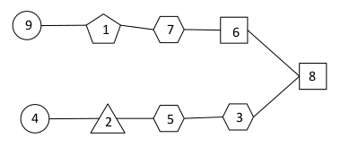

# AI Project
As I mentioned in the description, these are my introduction to artificial intelligence course's projects. It consists of three projects: 
 - [Midterm](./midterm) 
 - [Final](./final)
 - [Bonus](./bonus) 
 
## Midterm
If you know persian you could refer to the project description in the [file](./midterm/PA1.pdf), else read the following description. 

The [p1](./midterm/p1) project is about to solve a 2 by 2 rubiks cube by using three different algorithms. first algorithm is ids, second one is bidirecional search and the third one is A*. I've modeled rubik's cube using [this](https://stackoverflow.com/questions/500221/how-would-you-represent-a-rubiks-cube-in-code) link on stackoverflow and [this](http://symbolaris.com/orbital/Orbital-doc/examples/Algorithms/RubiksCube.java) file, so that we could model the rubik's cube using the 1-d list. The following is the indices I've used to model my rubik's cube using the link mentioned above. Then in each algrithm I have rotated the cube using the interesting [swap]() function ,again inspired by the link, until I reach the goal state.

                               +-------+
                               | 0   1 |
                               | 3   2 |
                        +------+-------+-------+
                        | 4  5 | 8   9 | 12 13 |
                        | 7  6 | 11 10 | 15 14 | 
                        +------+-------+-------+
                               | 16 17 |
                               | 19 18 |
                               +-------+
                               | 20 21 |
                               | 23 22 |
                               +-------+

The [p2](./midterm/p2) project is about to color states of Iran using simulated annealing algorithm and genetics algorithm. The figures in the associated files shows how was the operation of the algorithm.

# Final
Again if you know persian you could refer to [file](./final/Final Project-Fall 19_2.pdf).

This project is about classifing a test file by using n-gram models. It uses the backoff model to have a better prediction. But also I have changed the backoff model specially in bigram, to reach higher prediction, if you ask why you have done this I couldn't come up with a proper reason. If you understand or could find the bug or where I've made mistakes. 

# Bonus
Again if you know persian you could refer to [file](./bonus/Extra Project-Fall 19.pdf).

This project is a CSP problem. We have 5 different node types here:

- Circle: Which is denoted by 'C' and  have no constraints
- Square: This node is denoted by 'S' and its value is the *Least significant digit* of the *multiplication* of all adjacents
- Triangle: This node is denoted by 'T' and its value is the *most signigicant digit* of the *multiplication* of all adjacents
- Hexagon: This node is denoted by 'H' and its value is the *Least significant digit* of the *sum* of the all adjacents.
- Pentagon: This node is denoted by 'P' and its value is the *most significant digit* of the *sum* of the all adjacents.

The following is a example of a solved problem of this kind. I have used MRV heuristic and Forward checking to solve this problem. I have a variable in the code which is name is *mode*. It's a string and the first character of it enables or disables the MRV heuristic, the second character enables or disables forward checking.

